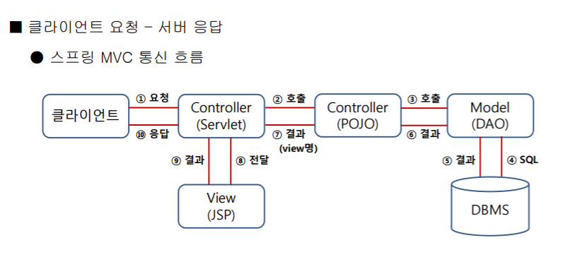
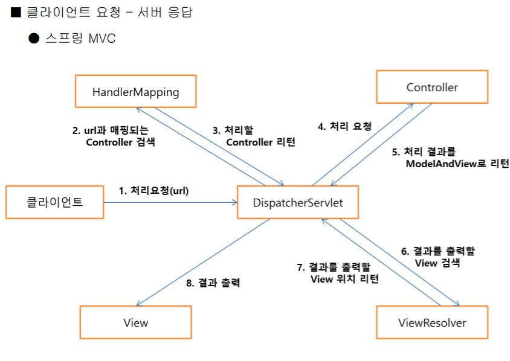

# Spring Boot

- Java로 구성되어 있음
- Flask서버 구축해서 Request했던것처럼 무언가를 요청하고 받아오는데 사용함.
- 가장 어렵고, 보안이 강하고,인기가 많은 기술
- JPA,SQLRcam? flask, Django -> Database에 삽입 삭제 해주는 기능을 간단히 사용가능?

- Controller!! 웹 불러오는 방법 2가지(html or 직접 입력)rest를 붙이냐 안붙이냐!

- log!!! 2가지 -> 로그쓸 상태를 직접 쓸꺼냐 

  ​					-> lombok쓸꺼냐

  1. 출력속도가 빠르다
  2. 파일 등을 이용하여 관리가 용이함

  

- build.gradle에 아래 명령어를 추가하면 됨!

  - implementation "org.springframework.boot:spring-boot-devtools"
  - 빌드 재실행(서버 재가동)안해도 되는 명령어

  

  STS 인코딩 설정 변경

- - windows - preferences - encoding utf-8

- Web application 제작
- Java, HTML/CSS/JS, Database + Spring

주석 : comment : 사람이 보려고 사용하는 주석

enertation? : 요거는 컴퓨터가 알아보기 위해 사용하는 주석

- 클라이언트 입장 :서버 URL 뒤에 어떤 단어를 쓰느냐에 따라 응답해주는 형식이 정해짐
- 서버 입장 : 클래스 생성시 클래스 변수타입에 따라 응답해주는 형식이 달라짐(ex / HTML ,JSON등)
- Controller,model(매개체역할?)

STS 설치

=> java - jar sp[Tab키누르기]

lombok 설치

=> java -jar lombok.jar

=>컨트롤러 클래스 생성

-> 메소드(@getMapping / @RequestMapping) 과같은 enotation을 써야함!

@ResponseBody  또는 @RestController -> JSON으로? HTML로 줄꺼냐

동적으로 데이터를 넘겨주려고 타임리프를 쓴것!

____

컴퓨터가 이상한 관계로 제대로 진도를 못나갔음... 제대로 정리해서 다시 올릴 예정