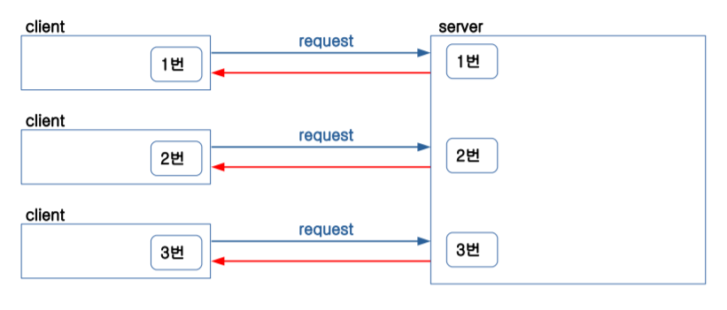

# Session

- HTTP 방식으로 클라이언트 와 서버간 통신

HTTP(s)란?

Hyper Text Transfer Protocol [Secure] -> 상태를 기억하지 않음(Stateless)

새로고침하면 모든 정보가 사라짐 ex)Log-in정보. --> Session을 사용하는 이유

Browser에 저장된 cookies(서버가 지정한 번호를 저장하는 임시 저장 공간)

ex) 1번 티켓 을 준다!

서버측에서 Session을 만료하면 기존 데이터 날아감!(로그아웃)

​     클라이언트측은 쿠키(번호)                                                 서버측은 세션(번호)

